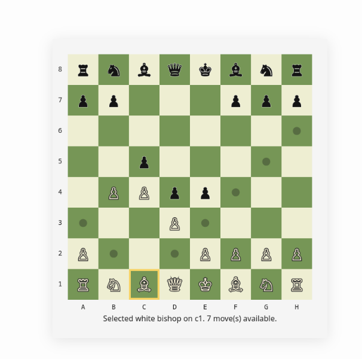
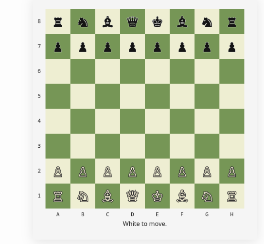

# Chess Game

A browser-based chess game built with **JavaScript** and **p5.js**. The project focuses on learning chess rules through clean, readable game logic while keeping the visual interface simple and interactive.

## Preview





## About The Project

This project implements a playable chess board from scratch using custom JavaScript classes for the game, board, squares, and pieces.

The game currently supports piece rendering, turn-based movement, legal move highlighting, captures, king safety, check, checkmate, stalemate, and automatic pawn promotion.

## Features

- Interactive 8x8 chess board rendered with p5.js.
- Standard chess starting position.
- White moves first, then turns alternate.
- Legal movement validation for kings, queens, rooks, bishops, knights, and pawns.
- Sliding pieces cannot jump over other pieces.
- Enemy captures are supported.
- Friendly-piece captures are rejected.
- Legal destination squares are highlighted when a piece is selected.
- King safety is enforced.
- Moves that leave the king in check are rejected.
- Check, checkmate, and stalemate status messages are displayed.
- Pawns automatically promote to queens on the final rank.


## Project Structure

```text
.
├── assets/
│   ├── demo.png
│   └── demo1.png
├── board.js
├── CHESS_RULES.md
├── index.html
├── sketch.js
└── style.css
```

## How To Run

Open `index.html` in a browser.

For a local development server, you can run:

```bash
python -m http.server 8000
```

Then open:

```text
http://localhost:8000
```

## Main Files

- `board.js` contains the core chess logic, board model, movement validation, check detection, checkmate, stalemate, and pawn promotion.
- `sketch.js` contains the p5.js rendering and mouse interaction logic.
- `CHESS_RULES.md` documents the chess rules from an implementation perspective.
- `index.html` loads p5.js and starts the project.

## Current Limitations

The project is not complete. These rules are not implemented yet:

- Castling
- Promotion choice UI for selecting queen, rook, bishop, or knight

## Why I Built This

I built this project to understand how chess rules can be translated into code. Instead of using a ready-made chess library, I implemented the board, movement rules, legal move validation, king safety, and game status logic manually.

The goal is to build a strong foundation that can later be extended into a complete chess game.

## License

This project is licensed under the MIT License. See `LICENSE` for details.
